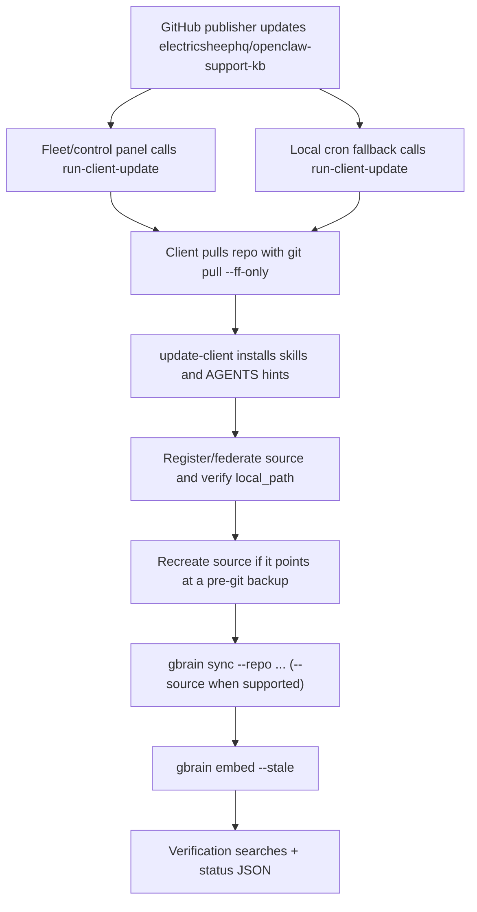

# Customer Support KB

Local-first customer support knowledge base and GBrain skillpack.

This repo turns public OpenClaw, Hermes Agent, Paperclip Mission Control,
Composio, release, safe runbook, skill discovery, and escalation knowledge into
a searchable local GBrain source. Cortex/GitHub should publish updates; every
agent machine keeps a local copy so support answers do not depend on a live
cloud lookup.

## Agent Install

Point the agent at this repo and tell it:

```text
Follow INSTALL_FOR_AGENTS.md in this repository. Install the Customer Support KB
into GBrain and verify local search works.
```

The canonical install location is:

```bash
~/.gbrain/sources/openclaw-support-kb
```

The canonical physical GBrain source id is:

```bash
openclaw-support-kb
```

Users do not push this repo. The publisher updates it; user machines pull it
read-only and sync it into local GBrain. The physical source stays
`openclaw-support-kb` for backwards compatibility, and `kb-sources.json`
declares logical namespaces for OpenClaw, Hermes Agent, Paperclip Mission
Control, and Composio so agents can avoid mixing config instructions.

The install script trusts the official repo URL by default. Development forks
must be pinned with `OPENCLAW_SUPPORT_KB_PINNED_REF` and explicitly allowed.
The official published repo is `electricsheephq/openclaw-support-kb`; upstream
OpenClaw release/docs data still comes from `openclaw/openclaw`.

This repo is not published as an npm package. `package.json` is only a local
script runner for agents/CI after they have already cloned this repo and changed
into the repo directory. The explicit `node scripts/...` commands below are the
canonical commands; `npm run ...` aliases are just convenience wrappers.

## Build

```bash
node scripts/build-kb.mjs
```

Local alias from this repo directory: `npm run build`.

The builder fetches:

- `https://docs.openclaw.ai/llms-full.txt`
- `https://api.github.com/repos/openclaw/openclaw/releases`
- `https://raw.githubusercontent.com/VoltAgent/awesome-openclaw-skills/main/README.md`
- `https://raw.githubusercontent.com/snyk/agent-scan/main/README.md`
- `https://docs.composio.dev/llms.txt`
- `https://docs.composio.dev/llms-full.txt`
- `https://composio.dev/toolkits`
- `https://hermes-agent.nousresearch.com/docs/llms.txt`
- `https://hermes-agent.nousresearch.com/docs/llms-full.txt`
- `https://paperclip.ing/llms.txt`
- `https://api.github.com/repos/paperclipai/paperclip/git/trees/master?recursive=1`
- selected Markdown docs from `https://github.com/paperclipai/paperclip`

It writes source-preserving docs/release Markdown, source-indexed policy
summaries, `kb-sources.json`, and `kb-manifest.json`.
Run `node scripts/check-manifest.mjs` after local edits to confirm the manifest still
matches the indexed artifact.

Source routing is intentionally layered: OpenClaw docs remain under `docs/`;
Hermes lives under `systems/hermes/`; Paperclip lives under
`systems/paperclip/`; Composio lives under `integrations/composio/`. Router
skills require the agent to identify the target system before applying config
or repair steps.

Skill discovery is intentionally layered: local VoltAgent snapshot, current
OpenClaw/ClawHub search, Snyk scan attestation before skill install, and local
Composio docs/toolkit catalog snapshots for approved SaaS workflows.

For vague reports that an OpenClaw agent is slow, broken, not responding,
missing tools, degraded, or "not as smart," this repo mirrors the
`file-bug-report` support skill and runbook. ClawHub remains the public install
source of record:

```bash
openclaw skills install file-bug-report
```

Builds refuse to replace arbitrary directories. The default managed target is
`~/.gbrain/sources/openclaw-support-kb`; non-default build targets need the
`.openclaw-support-kb-source` marker or `--force-managed-target`.

## Install On An Agent Machine

```bash
node scripts/update-client.mjs
```

Local alias from this repo directory: `npm run setup`.

Setup installs the managed customer KB skills into `~/.openclaw/skills`, writes
an agent hint block to active OpenClaw workspace `AGENTS.md` files, and syncs
this source into GBrain. Override skills destination with `OPENCLAW_SKILLS_DIR`.
When setup runs outside the canonical source directory, it keeps
`~/.gbrain/sources/openclaw-support-kb` as a git checkout of the published repo
instead of generating a non-git directory that GBrain cannot sync.

`sync:local` builds the KB into `~/.gbrain/sources/openclaw-support-kb`,
registers the federated GBrain source `openclaw-support-kb` when the installed
GBrain supports named sources, then runs:

```bash
gbrain sync --repo ~/.gbrain/sources/openclaw-support-kb --source openclaw-support-kb && \
  gbrain embed --stale
```

GBrain freshness is git based. `sync` records a per-source commit, imports only
the git diff after the first sync, deletes pages for deleted files, and forces a
full walk when its chunker version changes. `embed --stale` does not re-embed
everything; it fills only chunks whose embedding is missing. When a source row
already exists, GBrain's `sources add` keeps the old row, so setup verifies the
registered `local_path` and recreates the `openclaw-support-kb` source if it
still points at an old `.pre-git-*` backup.

If the discovered GBrain satisfies `kb-manifest.json` `minGbrainVersion` but
lacks named-source commands, `ensureGbrainSource()` falls back to:

```bash
gbrain sync --repo ~/.gbrain/sources/openclaw-support-kb && gbrain embed --stale
```

GBrain versions older than `minGbrainVersion` stop before indexing instead of
using the legacy fallback. If `gbrain` is not installed, setup fails unless
`OPENCLAW_SUPPORT_KB_ALLOW_NO_GBRAIN=1` is explicitly set for a degraded
read-only install. The installer checks `GBRAIN_BIN`, the Bun-linked source
install at `~/.bun/bin/gbrain`, `PATH`, and older local locations such as
`~/gbrain/bin/gbrain`. If the discovered GBrain is older than
`kb-manifest.json` requires, skills are still installed but indexing stops with
an explicit `gbrain upgrade` hint. A normal install also runs a verification
search after embedding. The verification runs two searches: one for this KB's
manifest and one for the Telegram docs. It fails on empty/no-result searches or
missing expected markers. Use `OPENCLAW_SUPPORT_KB_LOOSE_SEARCH_VERIFY=1` only
if a known-good GBrain version formats search output too tersely for marker checks.

The installed skills assume helper scripts are available from:

```bash
~/.gbrain/sources/openclaw-support-kb/scripts/
```

Routing expectation:

```bash
gbrain search "OpenClaw <question> Source: https://docs.openclaw.ai" --source openclaw-support-kb
gbrain search "Hermes Agent <question> Local KB namespace: hermes-agent" --source openclaw-support-kb
gbrain search "Paperclip Mission Control <question> Local KB namespace: paperclip-mission-control" --source openclaw-support-kb
```

## Automatic Updates

Install a managed local cron fallback after setup:

```bash
node scripts/install-auto-update.mjs --mode crontab --run-now
```

The installer appends or replaces only the managed
`openclaw-support-kb:auto-update` crontab block. It does not replace unrelated
crontab entries. Running without `--mode crontab` prints the managed block and
fleet command without changing the machine. The scheduled command runs:

```bash
node ~/.gbrain/sources/openclaw-support-kb/scripts/run-client-update.mjs --reason cron
```

`run-client-update.mjs` is also the fleet/control-panel entrypoint. To reduce
freshness lag, register the full `Fleet/control-panel immediate update command:`
printed by `node scripts/install-auto-update.mjs --mode print`; that command
preserves the `OPENCLAW_SUPPORT_KB_*`, `OPENCLAW_KB_CHANNEL`, and `PATH`
prefixes needed on customer machines.

The runner is lock-protected, pulls the published repo with `git pull --ff-only`,
runs `scripts/update-client.mjs`, syncs the named GBrain source when available
or legacy repo sync otherwise, embeds stale chunks, verifies search, and writes
status JSON to
`~/.gbrain/state/openclaw-support-kb-update.json`.

Check install health at any time:

```bash
node ~/.gbrain/sources/openclaw-support-kb/scripts/status.mjs
node ~/.gbrain/sources/openclaw-support-kb/scripts/status.mjs --json
```

The status command checks the source checkout, manifest, installed skills,
GBrain version, named-source page count and path, stale import checkpoints,
legacy `.pre-git-*` source backups, local update lock, search verification, and
cron registration. It exits 0 only when the KB is healthy or an update is
clearly running. If legacy backups are reported, move them out of the GBrain
sources directory with:

```bash
node ~/.gbrain/sources/openclaw-support-kb/scripts/repair-index.mjs
```



## Channels

The default channel is `stable`. Use `OPENCLAW_KB_CHANNEL=beta` on prerelease
OpenClaw installs.

## Support Escalation

Agents must draft and ask before sending support escalations. The helper binds
the approved draft, recipient, subject, transport, and account before sending.
Use `scripts/support-escalation.mjs`; do not call raw GOG or raw Telegram send
commands directly for support escalation. The helper uses GOG for email when
available and OpenClaw Telegram messaging for `@evaOS_support_bot` fallback.

## CI

`.github/workflows/update-kb.yml` rebuilds weekly, on OpenClaw release events,
and on daily release/docs freshness checks.
