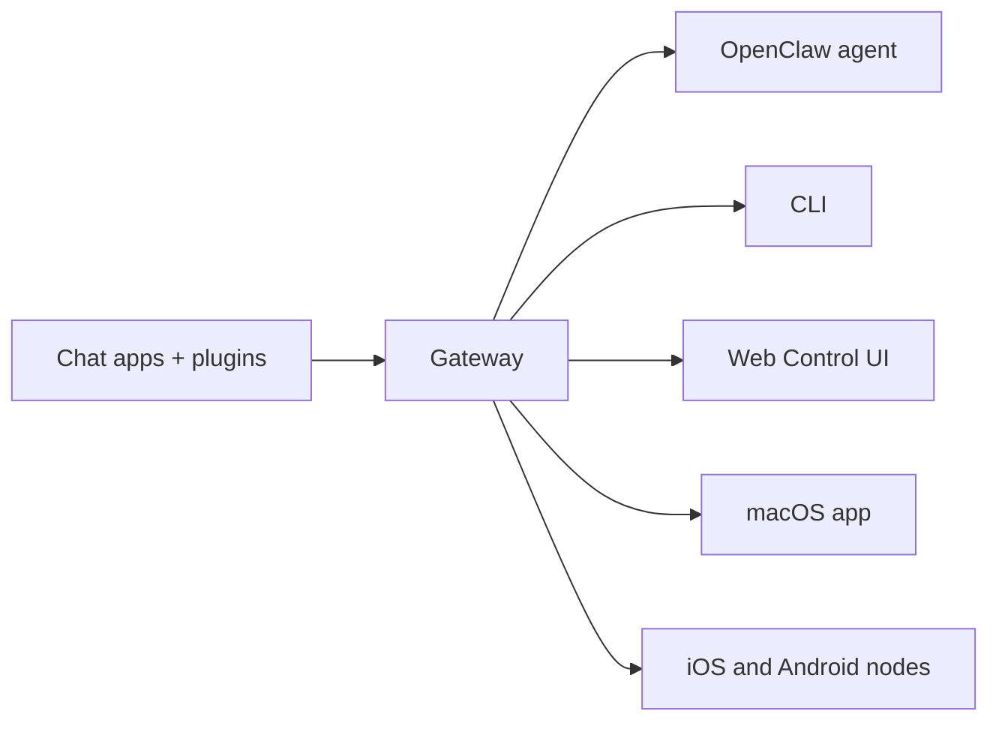

# OpenClaw
Source: https://docs.openclaw.ai/

# OpenClaw 🦞

<p align="center">
    
    
</p>

> _"EXFOLIATE! EXFOLIATE!"_ — A space lobster, probably

<p align="center">
  <strong>Any OS gateway for AI agents across Discord, Google Chat, iMessage, Matrix, Microsoft Teams, Signal, Slack, Telegram, WhatsApp, Zalo, and more.</strong><br />
  Send a message, get an agent response from your pocket. Run one Gateway across channel plugins, WebChat, and mobile nodes.
</p>

Columns


Get Started

    Install OpenClaw and bring up the Gateway in minutes.


Run Onboarding

    Guided setup with `openclaw onboard` and pairing flows.


Connect a Channel

    Link Discord, Signal, Telegram, WhatsApp, and more to chat from anywhere.


Open the Control UI

    Launch the browser dashboard for chat, config, and sessions.


## Browse docs

Mobile browsers may show the section menu without the full desktop tab bar. Use
these hub links to reach the same top-level docs areas from the page body.

Columns


Get started

    Overview, showcase, first steps, and setup guides.


Install

    Install paths, updates, containers, hosting, and advanced setup.


Channels

    Messaging channels, pairing, routing, access groups, and channel QA.


Agents

    Architecture, sessions, context, memory, and multi-agent routing.


Capabilities

    Tools, skills, cron, webhooks, and automation capabilities.


ClawHub

    Plugin marketplace, publishing, curation, and trust guidance.


Models

    Providers, model configuration, failover, and local model services.


Platforms

    macOS, Windows, iOS, Android, nodes, and web surfaces.


Gateway & Ops

    Gateway configuration, security, diagnostics, and operations.


Reference

    CLI reference, schemas, RPC, release notes, and templates.


Help

    Troubleshooting, FAQs, testing, diagnostics, and environment checks.


## What is OpenClaw?

OpenClaw is a **self-hosted gateway** that connects your favorite chat apps — Discord, Google Chat, iMessage, Matrix, Microsoft Teams, Signal, Slack, Telegram, WhatsApp, Zalo, and more via channel plugins — to AI coding agents. You run a single Gateway process on your own machine (or a server), and it becomes the bridge between your messaging apps and an always-available AI assistant.

**Who is it for?** Developers and power users who want a personal AI assistant they can message from anywhere — without giving up control of their data or relying on a hosted service.

**What makes it different?**

- **Self-hosted**: runs on your hardware, your rules
- **Multi-channel**: one Gateway serves every configured channel plugin simultaneously
- **Agent-native**: built for coding agents with tool use, sessions, memory, and multi-agent routing
- **Open source**: MIT licensed, community-driven

**What do you need?** Node 24.15+ (recommended), Node 22 LTS (`22.22.3+`) for compatibility, or Node 25.9+, an API key from your chosen provider, and 5 minutes. For best quality and security, use the strongest latest-generation model available.

## How it works



The Gateway is the single source of truth for sessions, routing, and channel connections.

## Key capabilities

Columns


Multi-channel gateway

    Discord, iMessage, Signal, Slack, Telegram, WhatsApp, WebChat, and more with a single Gateway process.


Plugin channels

    Channel plugins add Matrix, Nostr, Twitch, Zalo, and more; official plugins install on demand.


Multi-agent routing

    Isolated sessions per agent, workspace, or sender.


Media support

    Send and receive images, audio, and documents.


Web Control UI

    Browser dashboard for chat, config, sessions, and nodes.


Mobile nodes

    Pair iOS and Android nodes for Canvas, camera, and voice-enabled workflows.


## Quick start

Steps


Install OpenClaw

    ```bash
    npm install -g openclaw@latest
    ```


Onboard and install the service

    ```bash
    openclaw onboard --install-daemon
    ```


Chat

    Open the Control UI in your browser and send a message:

    ```bash
    openclaw dashboard
    ```

    Or connect a channel ([Telegram](/channels/telegram) is fastest) and chat from your phone.


Need the full install and dev setup? See [Getting Started](/start/getting-started).

## Dashboard

Open the browser Control UI after the Gateway starts.

- Local default: [http://127.0.0.1:18789/](http://127.0.0.1:18789/)
- Remote access: [Web surfaces](/web) and [Tailscale](/gateway/tailscale)

<p align="center">
  
</p>

## Configuration (optional)

Config lives at `~/.openclaw/openclaw.json`.

- If you **do nothing**, OpenClaw uses the bundled OpenClaw agent runtime; DMs share the agent's main session, and each group chat gets its own session.
- If you want to lock it down, start with `channels.whatsapp.allowFrom` and (for groups) mention rules.

Example:

```json5
{
  channels: {
    whatsapp: {
      allowFrom: ["+15555550123"],
      groups: { "*": { requireMention: true } },
    },
  },
  messages: { groupChat: { mentionPatterns: ["@openclaw"] } },
}
```

## Start here

Columns


Docs hubs

    All docs and guides, organized by use case.


Configuration

    Core Gateway settings, tokens, and provider config.


Remote access

    SSH and tailnet access patterns.


Channels

    Channel-specific setup for Discord, Feishu, Microsoft Teams, Telegram, WhatsApp, and more.


Nodes

    iOS and Android nodes with pairing, Canvas, camera, and device actions.


Help

    Common fixes and troubleshooting entry point.


## Learn more

Columns


Full feature list

    Complete channel, routing, and media capabilities.


Multi-agent routing

    Workspace isolation and per-agent sessions.


Security

    Tokens, allowlists, and safety controls.


Troubleshooting

    Gateway diagnostics and common errors.


About and credits

    Project origins, contributors, and license.

---
